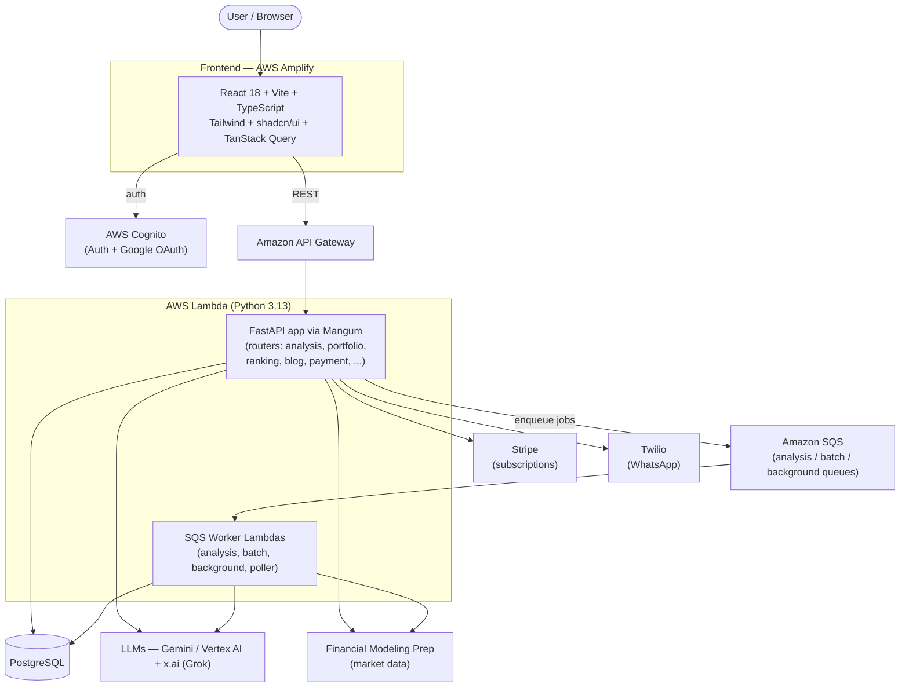
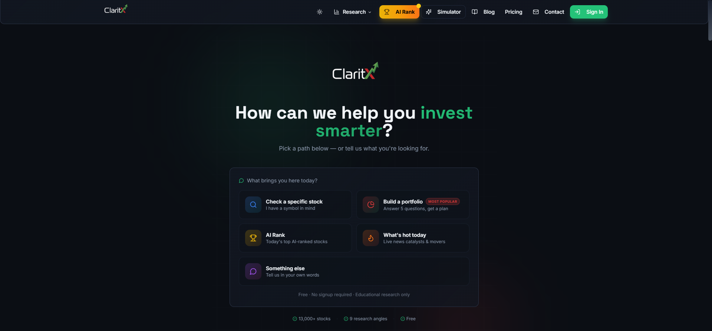
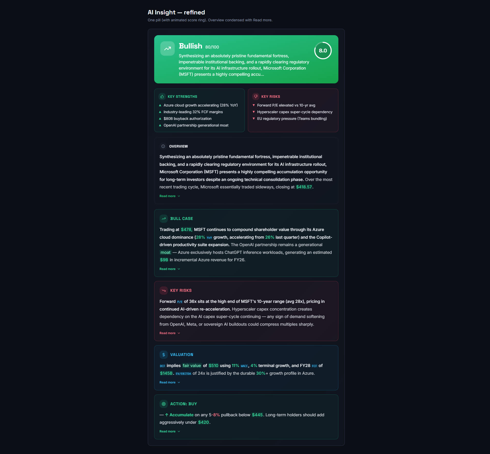
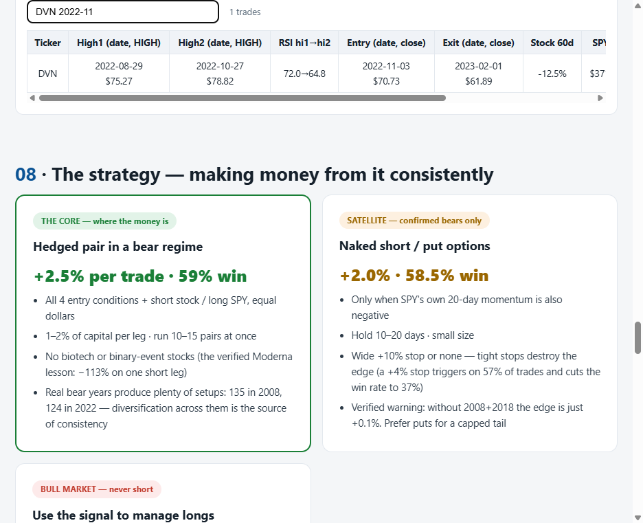

# ClaritX

**AI-powered stock analysis and personalized portfolio platform — evidence-based verdicts, risk-adjusted recommendations, and a portfolio builder, served by a serverless FastAPI backend on AWS.**

     

## Overview

ClaritX is a full-stack product I built to turn raw market data into clear, defensible investment decisions. A user enters a stock or a portfolio and gets an evidence-based AI verdict — **bullish, bearish, or neutral** — backed by fundamental analysis, risk-adjusted reasoning, and live financial data, rather than a black-box score.

Around that core I built a portfolio builder and simulator, an AI-driven stock ranking engine, a multi-step "deep search" research flow, auto-generated SEO blog content, a conversational chat layer, Stripe subscriptions, a credits system, and Twilio WhatsApp notifications.

The frontend is a React 18 + TypeScript SPA hosted on AWS Amplify. The backend is a Python FastAPI application deployed serverless on AWS Lambda (via AWS SAM and the Mangum adapter) behind API Gateway, with PostgreSQL for storage, AWS Cognito for auth, and Amazon SQS workers for long-running AI jobs. LLM reasoning is powered by Google Gemini / Vertex AI and x.ai (Grok); market data comes from Financial Modeling Prep (FMP).

> This is a personal portfolio project. The repository ships configuration templates only — no real credentials, endpoints, or infrastructure IDs are committed.

## Key Features

Feature areas map directly to the backend FastAPI routers under [`backend/routers/`](backend/routers/):

- **Stock Analysis (`analysis`)** — Evidence-based AI verdicts (bullish/bearish/neutral) with fundamental analysis, a ticker screener, stock search, similar-stock discovery, and per-symbol info and price endpoints. Heavy analyses are queued to SQS and processed asynchronously by a worker Lambda.
- **Portfolio (`portfolio`)** — Personalized portfolio builder and simulator. Stores user portfolios and a risk profile, generates risk-adjusted recommendations, and tracks price snapshots over time.
- **AI Ranking (`ranking`)** — Ranks stocks across a directory of symbols, exposing top-performing, lowest-performing, and full-list rankings plus per-stock detail.
- **Deep Search (`deep_search`)** — Multi-step research workflow: plan a research job, execute it across sources via background workers, and poll job status.
- **Blog (`blog`)** — Auto-generated, SEO-optimized blog content with grounded generation, daily auto-publishing, topic discovery, and image serving.
- **Chat (`chat`)** — Conversational, section-aware AI chat for drilling into analysis results.
- **Payments (`payment`)** — Stripe checkout, customer portal, subscription checks, cancellation, and a signed webhook handler.
- **Credits (`credits`)** — Usage-credit accounting with credit checks and coupon redemption.
- **WhatsApp (`whatsapp`)** — Twilio-backed WhatsApp subscriptions and digest delivery, including an inbound webhook.
- **Market (`market`)** — Market movers and daily opportunity scans, refreshed on a schedule.
- **Clients & eToro (`clients`, `etoro`)** — Client records and eToro geo/utility endpoints.
- **Sitemap (`sitemap`)** — Dynamic XML sitemaps (static, blogs, stocks) and search-engine ping for SEO.

## Architecture



The serverless topology (Lambda functions, SQS queues, scheduled jobs, and Cognito) is defined in [`backend/template.yaml`](backend/template.yaml). A single FastAPI app serves the synchronous API, while dedicated worker Lambdas consume SQS queues for real-time analysis, heavy batch ranking, and scheduled background tasks (daily blog research, hourly market-mover refresh, weekly data cleanup).

## Tech Stack

| Layer        | Technologies |
|--------------|--------------|
| **Frontend** | React 18, Vite, TypeScript, Tailwind CSS, shadcn/ui (Radix UI), TanStack Query, Recharts, React Router |
| **Backend**  | Python, FastAPI, Mangum (Lambda adapter), SQLAlchemy (async) |
| **Infra**    | AWS Lambda, AWS SAM, API Gateway, Amazon SQS, AWS Cognito, PostgreSQL, AWS Amplify (frontend hosting), AWS Secrets Manager |
| **AI / Data**| Google Gemini / Vertex AI, x.ai (Grok), Financial Modeling Prep (FMP) |
| **Integrations** | Stripe (payments), Twilio (WhatsApp) |

## Screenshots

**Landing page with AI ranking**



**Evidence-based AI verdict**



**Full analysis record (live)**



## Getting Started

### Prerequisites

- Node.js 18+ and npm
- Python 3.13
- AWS account with the [AWS SAM CLI](https://docs.aws.amazon.com/serverless-application-model/latest/developerguide/install-sam-cli.html) configured (for backend deploys)
- A PostgreSQL database and API keys for FMP, Gemini, x.ai, Stripe, and Twilio

### Frontend

```bash
# from the repository root
npm install
cp .env.example .env   # then fill in the values
npm run dev            # starts Vite on http://localhost:5173
```

### Backend

```bash
cd backend
python -m venv .venv
source .venv/bin/activate          # Windows: .venv\Scripts\activate
pip install -r requirements.txt
cp .env.example .env                # then fill in the values for local runs

# Deploy serverless to AWS via SAM
sam build
sam deploy --guided                 # supply DatabaseUrl, API keys, etc. as parameters
```

After `sam deploy`, copy the stack **Outputs** (`ApiUrl`, `CognitoUserPoolId`, `CognitoClientId`, `CognitoDomain`) into the frontend `.env` so the SPA can reach the deployed API and authenticate against Cognito.

## Project Structure

```
.
├── src/                  # React + TypeScript frontend (Vite)
│   ├── components/        # UI components (shadcn/ui + custom)
│   ├── pages/             # Route-level pages
│   └── lib/               # API adapter + AWS/Cognito config
├── backend/              # FastAPI backend (deployed on AWS Lambda)
│   ├── main.py            # FastAPI app + Mangum handler
│   ├── routers/           # Feature endpoints (analysis, portfolio, ...)
│   ├── services/          # External integrations (FMP, Gemini, Vertex, Twilio, batch)
│   ├── worker.py          # SQS worker entrypoint
│   ├── template.yaml      # AWS SAM infrastructure definition
│   └── requirements.txt
├── docs/                 # Documentation + screenshots
└── .env.example          # Frontend environment template
```

## License

Released under the [MIT License](LICENSE). Built as a personal portfolio project to demonstrate full-stack AI engineering.
